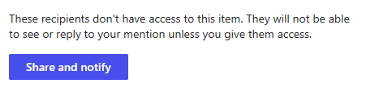

---
task:
    title: 'Task 4: Collaborate Using Pages'
---

### Task 4: Collaborate Using Pages 

For this task, you’ll be using the Work tab in Business Chat to experience the new “Pages” functionality, which allows you to collaborate and organize ideas in a dynamic, shareable space. Pages act much like Loop components, making it easy to capture and refine content directly within your chat.

> While we provide sample prompts, feel free to personalize them in your own style. Be creative and experiment. If Copilot doesn't give the desired output, refine your prompt and try again. Enjoy the process!

### Steps:

1. To launch Business Chat, open a new Edge browser tab and navigate to [microsoft.com/copilot](https://Microsoft.com/copilot)

1. If prompted, log into your work account.

1. Once Business Chat is open, select the **Work tab**:

    

1. Type the following prompt into the chat:

    ```text
    What are the key steps we should take to launch a successful giving campaign within our company?
    ```
1. Copilot will respond with a structured answer. Below the response, select **Edit in Pages**:

    

1. A new **Pages** window will open. This is a collaborative space where you and others can work together in real time. To share the Page, type the "@" symbol followed by a colleague’s name.

1. After adding your colleague, click on their name to give them access. They will receive an email notification with a link to collaborate on the Page:

    

1. Once your colleague has access, you are free to work together to refine the ideas and organize steps for the giving campaign.

**Next**: [Optional Task 1](https://maquinl.github.io/CELA-Academy-Microsoft-Copilot-Experience/Instructions/Labs/Optional_Task_1_Create_an_image.html) | [Optional task 2](https://maquinl.github.io/CELA-Academy-Microsoft-Copilot-Experience/Instructions/Labs/Optional_Task_2_Data_mine_large_document.html)

[Back to Index](https://maquinl.github.io/CELA-Academy-Microsoft-Copilot-Experience/)